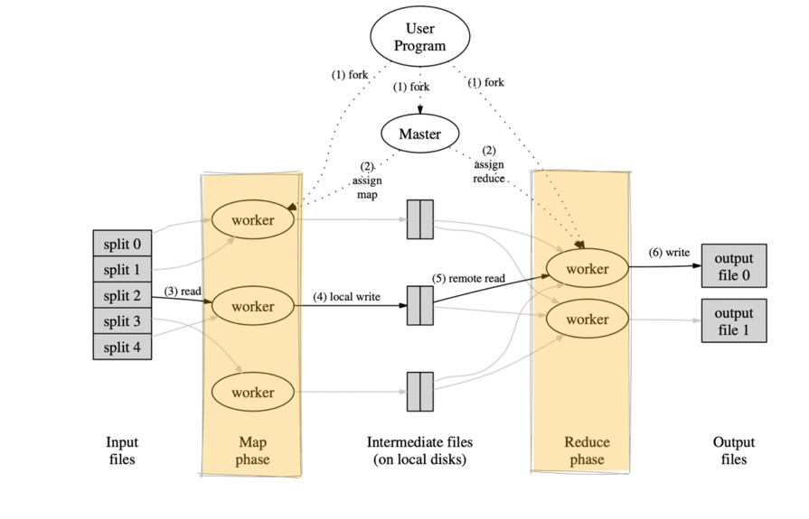

# Map Reduce

> Le Map Reduce est un model de programmation pour traiter et générer de large data sets. 
> Les utilisateurs vont spécifier 2 fonctions : La Map et le Reduce

Dans ce lab nous allons uniquement adrésser les fonctions : Map et Reduce



L'objectif de ce lab est de développer programmatiquement les fonctions Map et Reduce.
On prendra un fichier log de serveur web de type nginx, afin de retourner les ips qui ont plus consultées le site.

## Définir la fonction Map: 

La fonction Map va nous permettre de lire en entrée le fichier log et sortir des clés/valeurs.

Les clés/valeurs seront l'adresse ip et 1 : `216.57.210.72  1`

Vous pouvez voir l'implémentation en python de cette fonction : 


## Définir la fonction Reduce: 

La fonction Reduce a comme objectif de retourner les ips qui ont le plus consultée le site.  
Pour cela elle prendra en entrée la sortie du Map qui devra être triée, et elle appliquera l'implémentation de la fonction Reduce.

Vous pouvez voir l'implémentation en python de cette fonction : 


## Pour tester

#### Pour tester la fonction Map : 

Positionnez-vous dans le dossier du lab et lancer la commande : 

```shell
cat access.log| python mapper.py
```

La sortie sera : 

```shell
216.57.210.73   1
216.58.210.78   1
216.57.210.73   1
216.57.210.72   1
```

#### Pour tester le tri : 

Positionnez-vous dans le dossier du lab et lancer la commande : 

```shell
cat access.log| python mapper.py | sort
```

La sortie sera :

```shell
216.57.210.72   1
216.57.210.72   1
216.57.210.72   1
216.57.210.72   1
216.57.210.73   1
216.57.210.73   1
```

#### Pour tester la fonction Reduce


```shell
cat access.log| python mapper.py | sort | python reducer.py
```

la sortie sera : 

```shell
216.57.210.72   4
216.57.210.73   3
216.58.210.78   1
```