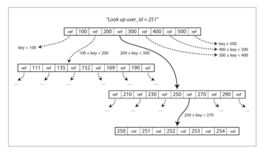
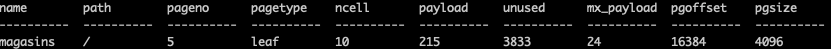
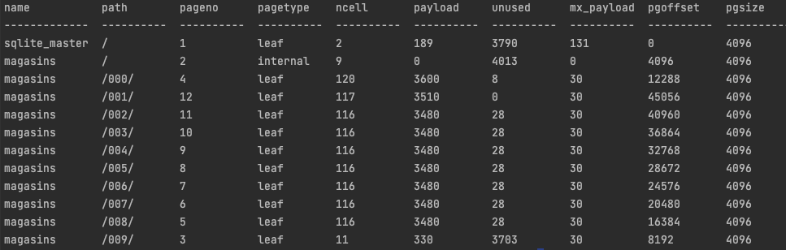
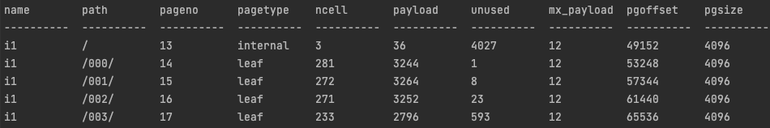

Prérequis: 
----------

* Avoir sqlite3 d'installé, nativement c'est fait sur Macos.
* .headers ON :  pour afficher le nom des colonnes  
* .mode column :  pour afficher en mode colonnes  

Introduction:
------------

```
Les données sont stockées sous forme de pages.

Les tuples de la table sont stockées sur plusieurs pages.

Pour faciliter l'accès aux pages lors d'une requête on utilise des méthodes d'accès.

On utilise soit un scan séquentiel ou un scan par index.

Dans le cas de sqlite on utilise l'algorithme B-tree pour stocker les pages et les index.
 ```


   


Initialisation:
------------

```sql
CREATE TABLE magasins (
id   INTEGER PRIMARY KEY AUTOINCREMENT,
nom VARCHAR(16),
ville VARCHAR(32) ,
identifiant_produit INTEGER, 
en_stock BOOLEAN
);
```

```sql
INSERT INTO magasins('nom', 'ville','identifiant_produit', 'en_stock') VALUES ('microgame','paris', 1, TRUE);
INSERT INTO magasins('nom', 'ville','identifiant_produit', 'en_stock') VALUES ('microgame','paris', 3, TRUE);
INSERT INTO magasins('nom', 'ville','identifiant_produit', 'en_stock') VALUES ('microgame','paris', 5, FALSE);
INSERT INTO magasins('nom', 'ville','identifiant_produit', 'en_stock') VALUES ('macrogame_21','lille', 1, TRUE);
INSERT INTO magasins('nom', 'ville','identifiant_produit', 'en_stock') VALUES ('macrogame_21','lille',5, FALSE);
INSERT INTO magasins('nom', 'ville','identifiant_produit', 'en_stock') VALUES ('irongame','paris', 4, TRUE);
INSERT INTO magasins('nom', 'ville','identifiant_produit', 'en_stock') VALUES ('irongame','paris', 3, TRUE);
INSERT INTO magasins('nom', 'ville','identifiant_produit', 'en_stock') VALUES ('irongame','paris', 5, FALSE);
INSERT INTO magasins('nom', 'ville','identifiant_produit', 'en_stock') VALUES ('decagame','toulouse', 2, TRUE);
INSERT INTO magasins('nom', 'ville','identifiant_produit', 'en_stock') VALUES ('decagame','toulouse', 5, TRUE);
```


Quand une donnée est stockée dans une page:
------------

```sql
SELECT * FROM dbstat;
SELECT sum(pgsize-unused)*100.0/sum(pgsize) FROM dbstat WHERE name='produits';
```

```sql
  name       TEXT,        -- Name of table or index
  path       TEXT,        -- Path to page from root
  pageno     INTEGER,     -- Page number, or page count
  pagetype   TEXT,        -- 'internal', 'leaf', 'overflow', or NULL
  ncell      INTEGER,     -- Cells on page (0 for overflow pages)
  payload    INTEGER,     -- Bytes of payload on this page or btree
  unused     INTEGER,     -- Bytes of unused space on this page or btree
  mx_payload INTEGER,     -- Largest payload size of all cells on this row
  pgoffset   INTEGER,     -- Byte offset of the page in the database file
  pgsize     INTEGER,     -- Size of the page, in bytes
  schema     TEXT HIDDEN, -- Database schema being analyzed
  aggregate  BOOL HIDDEN  -- True to enable aggregate mode
```



```sql
SELECT sum(pgsize-unused)*100.0/sum(pgsize) FROM dbstat WHERE name='produits';
```

- La donnée est sur une page et elle est de type leaf
- La taille d'une page est de 4096 bytes
- Moins de 7% de la page est utilisé  


Charger des données d'un fichier  :
------------


```shell
sqlite> .mode csv
sqlite> .import ./produits.csv magasins
```

```sql
SELECT * FROM dbstat;
```



c

````sql
CREATE INDEX i1 ON magasins('ville');
````

