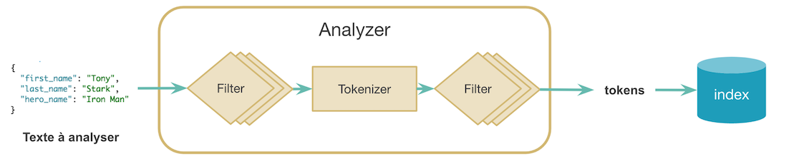

Prérequis: 
----------

* Avoir docker et docker-compose d'installé .


Introduction:
------------

```
Base de données NoSQL :

- Distribuée
- Orientée Document
- Open source et très active

Utilise la librairie Lucene pour faire des recherches full text sur les données.  
```

Initialisation:
------------

```shell
docker-compose up -d 
```

Ajouter les données de tests e-commerce fourni avec l'installation.


REPRÉSENTATION DES DONNÉES SUR ELASTICSEARCH :
-------------------------------------------

```
Index = organisation de la donnée sur un ou plusieurs types : analogue à une base en relationnel

Document = Objet unitaire qui porte la donnée : analogue à une ligne
```

Dans la section DevTools de Kibana lancer une recherche sur l'indice kibana_sample_data_ecommerce.

```shell
GET kibana_sample_data_ecommerce/_search
```

Renvoie un ensemble de documents stockés dans l'indice avec les métadonnées.


INTERAGIR AVEC ELASTICSEARCH :
-----------------------------

Dans chaque document on a le champ score : il permet de classer la pertinence du document par rapport à la recherche initiale.

Dans notre exemple, on a un score de 1 : absence de critère de recherche en entrée.


```shell
GET kibana_sample_data_ecommerce/_search
{
  "query": {
    "match": {"customer_full_name":"eddie"}
  }
}
```

Le score est différent : le résultat avec le meilleur score est renvoyé en premier.

ElasticSearch est un index inversé : stocke les « tokens » de la donnée indexée en clé.


Avant de stocker la donnée, on passe par une phase d'analyse pour créer l'indice inversé.




On récupère le champ _id d'un résultat de la  dernière requête  : some_id

```shell
GET kibana_sample_data_ecommerce/_doc/some_id
```

Absence du score : dans cette requête, on ne demande plus à Elastic d'utiliser le moteur de recherche, 
mais de récupérer directement le document.
